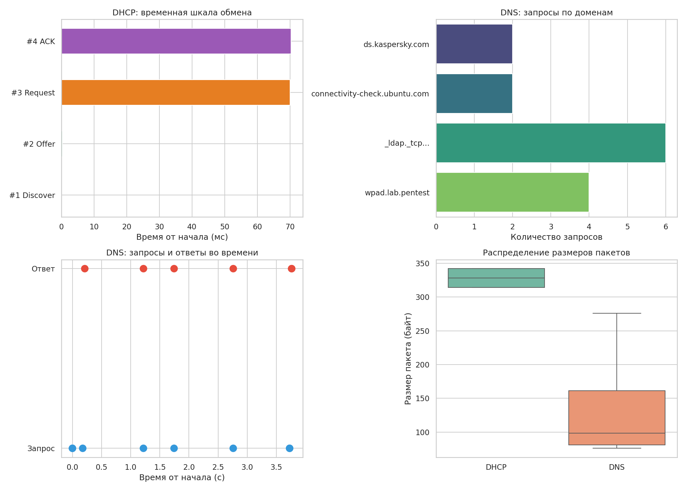

# Домашнее задание 12. Python для аналитиков ИБ: форензика

## Описание

Анализ сетевых дампов (DHCP и DNS) с помощью pyshark. Извлечение ключевых артефактов и визуализация результатов.

## Используемые инструменты

- Python 3
- pyshark — разбор сетевых дампов (.pcapng)
- Matplotlib — построение графиков
- Seaborn — стилизация и дополнительные типы графиков

## Структура репозитория

```
analyze_pcap.py       — основной скрипт анализа
dhcp.pcapng           — предоставленный DHCP-дамп (4 пакета)
dns_capture.pcapng    — захваченный DNS-дамп (14 пакетов)
dhcp_analysis.png     — визуализация результатов (4 графика)
artifacts.json        — извлеченные артефакты в формате JSON
artifacts.csv         — извлеченные артефакты в формате CSV
```

## Установка зависимостей

```bash
pip install pyshark matplotlib seaborn
```

Также необходим tshark (входит в состав Wireshark):

```bash
sudo apt install tshark
```

## Запуск

```bash
python3 analyze_pcap.py
```

## Что делает скрипт

### Этап 1 — Загрузка данных

Загружаются два сетевых дампа:
- `dhcp.pcapng` — предоставленный дамп с DHCP-обменом
- `dns_capture.pcapng` — дамп DNS-трафика, захваченный с помощью tshark в локальной сети

### Этап 2 — Извлечение артефактов

Из DHCP-дампа:
- типы сообщений (Discover, Offer, Request, ACK)
- IP-адреса клиента и сервера
- MAC-адреса
- параметры аренды (маска подсети, время аренды, transaction ID)

Из DNS-дампа:
- DNS-запросы и ответы
- запрашиваемые домены (ds.kaspersky.com, connectivity-check.ubuntu.com, _ldap._tcp.dc._msdcs.t1.soc.ecssec.ru, wpad.lab.pentest)
- IP-адреса клиентов и DNS-серверов
- результаты резолвинга (A-записи, NXDOMAIN)

Всего обнаружено 12 уникальных IP-адресов и 4 уникальных домена.

### Этап 3 — Визуализация

Скрипт строит 4 графика и сохраняет в `dhcp_analysis.png`:

1. Временная шкала DHCP-обмена
2. Частота DNS-запросов по доменам
3. DNS-запросы и ответы во времени
4. Распределение размеров пакетов (DHCP vs DNS)

Результаты также сохраняются в `artifacts.json` и `artifacts.csv`.

## Результат визуализации


